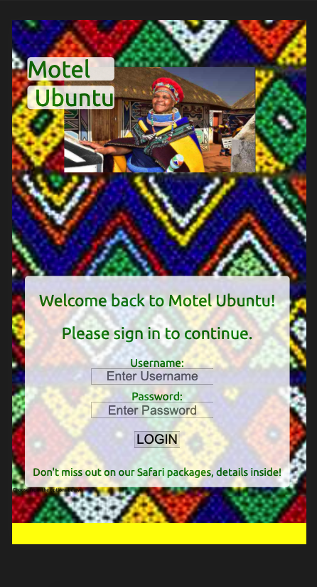
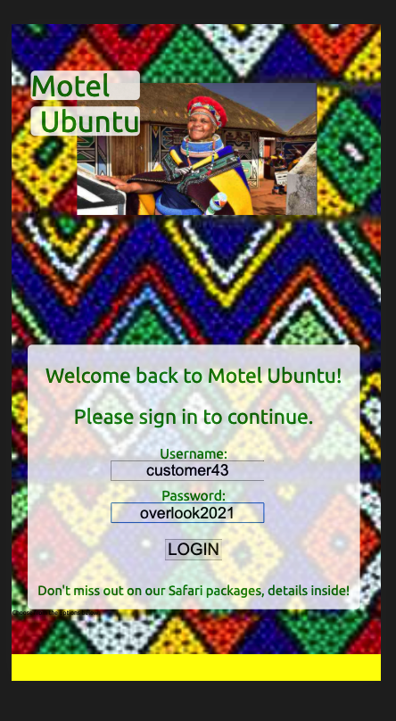
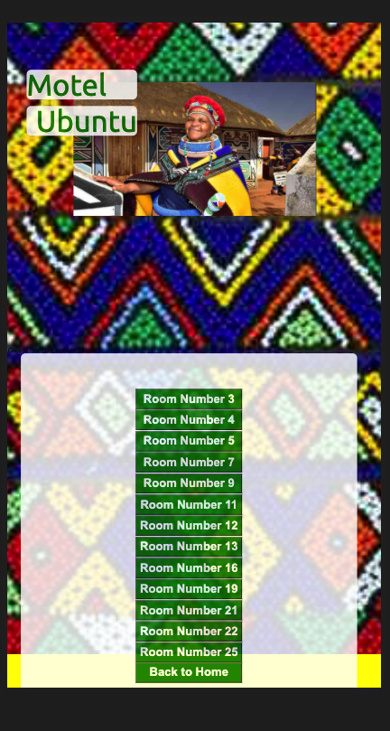
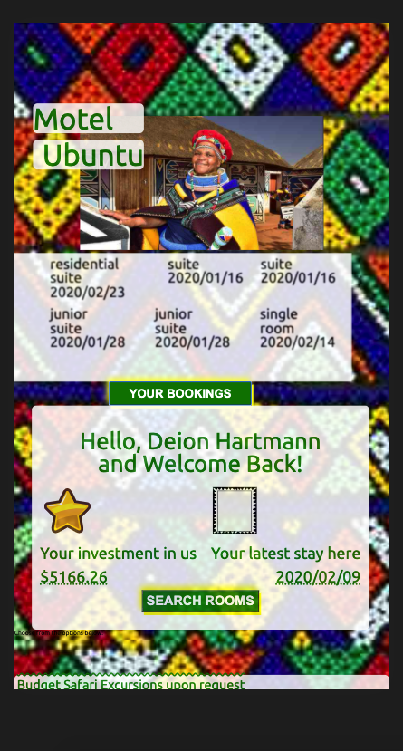

## Motel Ubuntu Project
#### **Contributors:** [Chuck Morris](https://github.com/percworld)
---
### Motel Ubuntu lies in the roots of South Africa, where there is a heritage of hospitality and an instinct for a generosity.

#### This app is designed to keep a hotel bookkeeping record and assist the customer in choosing and booking rooms while maintaining an account.  #### The users, hotel rooms, and bookings are hosted on a server and accessible through API calls.
---
#### Navigation of the app:

1. Login using the credentials listed below.
2. You will see your status level as someone who has invested in the company. Your last stay is visible on the right.
4. Search for a room based on your preference and for the date you would like to stay
5. Choose which room you would like and your account will update.  This is now stored on the server and cannot be overbooked.
6. If you would like to see your current bookings, the hovering see bookings button will shpw all past and future bookings.

---
#### Login Credentials
* **username** - There are 50 user names available ranging from ```customer1``` to ```customer50```
* **password** - all passwords are ```overlook2021```
---
          
---
### To Install:
1. Clone down this repo and `cd` into the root directory.
2. I the console, Install dependencies by running `npm install`
3. Clone the backend API at https://github.com/turingschool-examples/overlook-api
4. In a separate console window `cd` into the backend directory by running `npm install` then `npm start`
5. Start the client with `npm start` in the root project directory
6. navigate in your browser to http://localhost:8080/

---
#### Technologies:
---
##### This project utilizes:
* Sass
* Webpack and Node
* Datepicker
* JQuery

##### I enjoyed using [Postmaster] to balance calls to the API


If you _are_ done, you can follow [this procedure](./gh-pages-procedure.md) to get your project live on GitHub Pages.
=======
# overlook
Hotel bookings
>>>>>>> f86b9f91df874035b0cacf27d70e2ca5ff647d67
